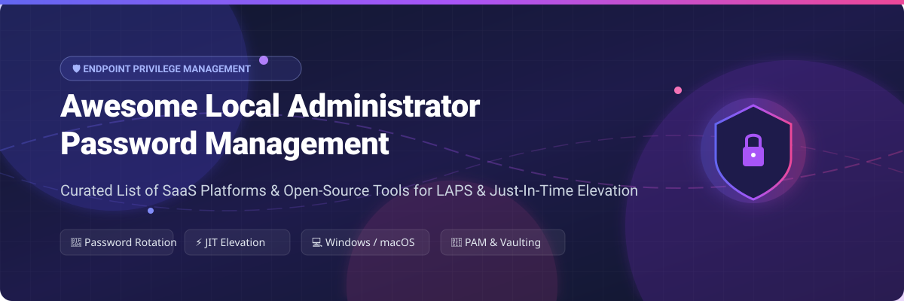

 

  

# 🔐 Awesome Local Administrator Password Management (LAPS)

> A curated list of **SaaS platforms**, enterprise **Privileged Access Management (PAM)** solutions, and **Open-Source GitHub projects** for Local Administrator Password Management, automated credential rotation, Just-In-Time (JIT) privilege elevation, and endpoint privilege security on Windows, macOS, and Linux.

---

## 📌 Overview & Key Concepts

**Local Administrator Password Management (LAPS)** and **Endpoint Privilege Management (EPM)** automate the rotation, secure storage, and controlled access of local administrator and root credentials across enterprise endpoints. Eliminating static, shared local admin passwords reduces lateral movement risks, pass-the-hash attacks, and unauthorized privilege escalation.

### 🎯 Key Pillars:
* 🔄 **Automated Credential Rotation**: Periodically generates randomized, complex passwords for local administrative accounts.
* 🔒 **Secure Credential Vaulting**: Encrypts and securely stores passwords in Active Directory, Microsoft Entra ID, or specialized PAM vaults.
* ⚡ **Just-In-Time (JIT) Elevation**: Grants temporary, audited administrator access for approved maintenance windows.
* 💻 **Cross-Platform Privilege Control**: Manages endpoints across Windows, macOS, and Linux environments.

---

## 📑 Table of Contents

- [🏢 SaaS & Enterprise Platforms](#-saas--enterprise-platforms)
- [🔓 Open-Source GitHub Projects](#-open-source-github-projects)
- [💡 Architectural Best Practices](#-architectural-best-practices)
- [🤝 How to Contribute](#-how-to-contribute)
- [📈 Star History](#-star-history)
- [☕ Support & Sponsorship](#-support--sponsorship)
- [⚠️ Disclaimer](#%EF%B8%8F-disclaimer)

---

## 🏢 SaaS & Enterprise Platforms

> **📊 Market Size & Sector Structure**: The global Privileged Access Management (PAM) & Endpoint Privilege Management (EPM) sector is estimated at **$4.5 Billion – $6.3 Billion** in 2026, expanding at a CAGR of **20% to 29%**. The market exhibits **moderate concentration**; while major platform vendors lead enterprise adoption, it is not a "winner-take-all" market, maintaining a diverse ecosystem of specialized security vendors moving toward platform consolidation.

The following table lists commercial SaaS and enterprise solutions for local administrator password management, sorted by **Company Size / Revenue / Valuation** (descending):

| SaaS Product / Link | Description | Starting Pricing | Free Tier / Free Trial Limits | Company Size / Valuation / Revenue |
| :--- | :--- | :--- | :--- | :--- |
| **[Microsoft LAPS / Intune](https://learn.microsoft.com/windows-server/identity/laps/laps-overview)** 🌐 | Built-in Windows feature that automatically rotates local admin passwords and backs them up to Active Directory or Microsoft Entra ID. | **$8/user/month** (via Microsoft Intune Plan 1 / M365 E3/E5); $0 add-on cost for native Windows LAPS. | **30-day free trial** for Microsoft Intune Plan 1 (up to 25 user licenses). | **~$3 Trillion Market Cap** / $245B+ Annual Revenue |
| **[CyberArk Endpoint Privilege Manager](https://www.cyberark.com/products/endpoint-privilege-manager/)** 🛡️ | Enterprise endpoint privilege management that enforces least privilege, controls application elevation, and defends credentials. | Starts at **~$150,000/year** base enterprise deployment estimate for enterprise suite modules. | **30-day guided trial / Proof of Concept (PoC)** for CyberArk Secure Cloud Access upon request. | **$25 Billion Valuation** (Acquired by Palo Alto Networks in Feb 2026) |
| **[BeyondTrust Privilege Management](https://www.beyondtrust.com/privilege-management)** 🔑 | Comprehensive PAM platform focused on eliminating local admin rights, policy-based elevation, and credential rotation. | Enterprise licensing starts at **~$30,000/year** for modular asset and user packages. | **14-day to 30-day evaluation trial** available upon sales request. | **~$1.5 Billion Valuation** / $400M+ ARR |
| **[Delinea Privilege Manager](https://delinea.com/products/privilege-manager)** 💼 | Privilege elevation and secret vaulting platform (Secret Server) eliminating standing local administrator rights. | **$8 to $18/privileged account/month** for Secret Server Cloud base plans. | **30-day free trial** for Secret Server Cloud with full vaulting features enabled. | **~$400M+ ARR** (Targeting $1B ARR) |
| **[Netwrix Password Secure](https://www.netwrix.com/)** 🔒 | Privileged account and password management offering secure credential storage, automated rotation, and session auditing. | Starts at **~$12/user/month** (or $1,500/year starting base license tier). | **20-day full-featured free trial** for up to 50 managed test credentials. | **$235 Million – $250 Million ARR** |
| **[ManageEngine PAM360](https://www.manageengine.com/privileged-access-management/)** 📊 | Enterprise PAM suite providing password vaulting, automated rotation, and session management for local and domain accounts. | **$7,995/year** starting plan (covers 10 administrators and 25 keys). | **30-day evaluation trial** with all enterprise features enabled. | **$57 Million – $87 Million ARR** (Division of Zoho Corp) |
| **[Admin By Request](https://www.adminbyrequest.com/)** ⚡ | Just-In-Time (JIT) privilege elevation solution allowing temporary user admin rights with approval workflows and full auditing. | **$39.50/seat/year** starting price for paid tier deployments. | **Free Lifetime Plan** for up to 25 EPM workstation seats, 10 server seats, and 25 SRA seats. | **~$17 Million ARR** |
| **[Securden Password Vault](https://www.securden.com/)** 🔐 | Centralized password vault and endpoint privilege manager supporting automated password rotation and role-based access. | Starts at **~$1,195/year** for 5 administrators (Enterprise Edition base). | **Free Lifetime Plan** for up to 5 users; **30-day full trial** for enterprise tiers. | **$11.6 Million – $16.4 Million ARR** |
| **[AutoElevate by CyberFOX](https://autoelevate.com/)** 🚀 | Policy-driven privilege management built for IT teams and MSPs to eliminate local admin rights on Windows endpoints. | Starts at **~$2.50/endpoint/month** (minimum 25 endpoint licenses). | **14-day free trial** for internal IT departments and MSPs. | **$100 Million Funding** / 20x ARR Growth |

---

## 🔓 Open-Source GitHub Projects

Community-driven open-source projects, secrets management engines, and rotation utilities. Sorted by **GitHub Star Count** (descending):

1. **[HashiCorp Vault](https://github.com/hashicorp/vault)**  🔑  
   Identity-based secret and encryption management engine capable of dynamic local admin credential generation, vaulting, and rotation.

2. **[Infisical](https://github.com/Infisical/infisical)**  ⚡  
   Open-source secret management platform for centralizing local administrator credentials, API keys, and environment configurations.

3. **[KeePassXC](https://github.com/keepassxreboot/keepassxc)**  🛡️  
   Cross-platform community password manager used for storing rotated local administrator passwords with encrypted database files.

4. **[Teleport](https://github.com/gravitational/teleport)**  🌐  
   Identity-native infrastructure access management providing Just-In-Time elevation, zero-trust access control, and session auditing.

5. **[Bitwarden Server](https://github.com/bitwarden/server)**  🔒  
   Open-source password management backend infrastructure for storing, sharing, and auditing administrative credentials across organizations.

6. **[Wazuh](https://github.com/wazuh/wazuh)**  📊  
   Open-source security monitoring platform used to track local administrator password changes, privilege elevation events, and file integrity.

7. **[OpenBao](https://github.com/openbao/openbao)**  📦  
   Community-governed open-source fork of Vault for managing, auditing, and rotating sensitive local administrator secrets.

8. **[Google Santa](https://github.com/google/santa)**  🍏  
   macOS binary authorization system providing application execution control and endpoint privilege containment for Apple fleets.

9. **[Kansa](https://github.com/davehull/Kansa)**  💻  
   PowerShell-based incident response framework useful for inspecting, auditing, and querying local administrator accounts across fleets.

10. **[CyberArk Conjur Open Source](https://github.com/cyberark/conjur)**  🔒  
    Privileged access management and secret retrieval engine designed for infrastructure, cloud tools, and DevOps automation.

11. **[macOSLAPS](https://github.com/joshua-d-miller/macOSLAPS)**  🍎  
    Open-source utility that automatically rotates local administrator passwords on macOS endpoints and syncs values to Active Directory or MDM.

12. **[Lithnet Access Manager](https://github.com/lithnet/access-manager)**  🌐  
    Web front-end for Microsoft LAPS password retrieval, BitLocker recovery key access, and Just-In-Time local admin elevation workflows.

13. **[SLAPS (Serverless LAPS)](https://github.com/jseerden/SLAPS)**  ☁️  
    PowerShell serverless approach for rotating local administrator passwords on Windows endpoints and storing secrets in Azure Key Vault.

---

## 💡 Architectural Best Practices

* **Enable Native Windows LAPS**: Utilize built-in Windows LAPS for Active Directory or Entra ID joined devices for baseline credential protection.
* **Adopt macOS LAPS / MDM Policies**: Deploy `macOSLAPS` or MDM password rotation payloads for Apple endpoints.
* **Eliminate Standing Admin Access**: Shift from permanent administrator privileges to approval-based **Just-In-Time (JIT)** elevation.
* **Audit Credential Retrieval**: Enforce MFA, RBAC, and strict logging whenever an administrator retrieves a local admin password.

---

## 🤝 How to Contribute

Contributions are welcome! To add a new platform or open-source tool:

1. Fork this repository.
2. Update `README.md` following the established table or list format.
3. Include product name, official link, short description, pricing/star badge, and license details.
4. Submit a Pull Request with a clear description of your additions.

Read our curated awesome directory at [Awesome-Awesome-Awesome](https://github.com/ishandutta2007/Awesome-Awesome-Awesome).

---

## 📈 Star History

---

## ☕ Support & Sponsorship

Thank you for visiting and supporting this repository! If you find this curated list helpful for your enterprise security architecture or IT operations, please consider starring ⭐, forking 🍴, or sharing it with your network.

---

## ⚠️ Disclaimer

- This repository is a **community-curated list** provided for educational and informational purposes only.
- Local administrator password management is security-critical. Incorrect implementation can cause domain lockouts or privilege compromise. Test all solutions in staging environments prior to production rollout.
